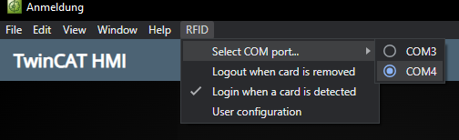

# RFID Authentication

This sample extension enables login to the TwinCAT HMI Server with an RFID
reader. An RFID reader is connected to the device that runs the TwinCAT UI
Client with a serial connection. The serial communication with the RFID reader
is handled in C++ in the projects in the *C++SourceCode* directory. The
generated DLL is used with the *Node.js* foreign function interface *koffi* to
communicate with the RFID reader in the *Node.js* environment. The *RFIDAuth*
extension in the *TcUiClientExtension* directory reads the Unique Identifier
(UID) of RFID cards it detects and sends a login command to the TwinCAT HMI
Server. The login command is handled by a custom
[Server Extension](https://infosys.beckhoff.com/index.php?content=../content/1031/te2000_tc3_hmi_engineering/3730608907.html&id=)
in the *RFIDAuth* C# project in the *RFIDAuthServerExtension* directory that
identifies users by the UID of the detected RFID card and performs a login.

## Prerequisites

To use this sample, you need either

- an [iDTRONIC based RFID reader](https://infosys.beckhoff.com/index.php?content=../content/1031/rfid_reader/525343245915465645195.html&id=)
  and the installed
  [driver](https://www.silabs.com/developers/usb-to-uart-bridge-vcp-drivers)\
  --- or ---
- a [Baltech based RFID reader](https://infosys.beckhoff.com/english.php?content=../content/1033/rfid_reader/1516178010715465651339.html&id=)
  and the
  [Baltech Tool Suite](https://infosys.beckhoff.com/english.php?content=../content/1033/rfid_reader/1516178010715465651339.html&id=)\
  --- or ---
- an [EKS from Euchner](https://www.euchner.de/en-us/a/098513/) and its
  [driver](https://www.euchner.de/en-us/service/downloads/software/eks-usb-drivers-demo-test-software/)

An instance of the
[TwinCAT HMI Server](https://infosys.beckhoff.com/index.php?content=../content/1031/tf2000_tc3_hmi_server/index.html&id=)
is also required and [Visual Studio](https://visualstudio.microsoft.com) must
be installed to build the server extension. The
[`npm`](https://nodejs.org/en/download) command line tool is required as well
to install JavaScript dependencies.

## Getting Started

This section describes how to set up and run the sample.

### Configuring the RFID reader and the TwinCAT UI Client

Make sure the RFID reader is connected to the same machine that the TwinCAT UI
Client is running on. Make sure it shows up in the Windows Device Manager and
that it's assigned a COM port. The *iDTRONIC* will show up as
*Silicon Labs CP210x* and the *EKS* as *EUCHNER Electronic-Key-System*.


> The *Baltech* based reader needs to be configured with the
  *Baltech Tool Suite* before it can be used. The configuration used by this
  extension can be found in the [Misc](Misc) directory. The configuration
  should work with all card types, although *Baltech* recommends to configure a
  specific card type in production environments.

You must also add the extension to the configuration file of the TwinCAT UI
Client by adding a new entry in the `"extensions"` object as follows:

```JSON
"extensions": {
    "RFID": {
        "name": "RFIDAuth",
        "directory": "path\\to\\this\\directory\\TcUiClientExtension",
        "version": "^1.0.0"
    }
}
```

Open a shell in the *TcUiClientExtension* directory and run the following
command to install the extensions dependencies:

```sh
npm install
```

To verify that the extension is identified correctly, start the TwinCAT UI
Client. If no error message is displayed and the *RFID* entry shows up in the
application menu, the extension is loaded correctly. If you don't see an
application menu, make sure to set `"enableMenuBar": true` in the configuration
file of the TwinCAT UI Client. Select the correct COM port from the application
menu and close the TwinCAT UI Client. Alternatively, you can set the COM port
in the [settings.json](TcUiClientExtension/settings.json) file. In the
*settings.json* file, you must also set the `"deviceType"` property to
`"iDTRONIC"`, `"Baltech"` or `"EKS"`, depending on your reader device.



### Configuring the TwinCAT HMI Server

If you are working with a TwinCAT HMI project, you can add the *RFIDAuth*
project to the solution and add a reference to it. If you are using a
standalone instance of the TwinCAT HMI Server, open the
[RFIDAuth.sln](RFIDAuthServerExtension/RFIDAuth.sln) solution and build it.
Open the config page of the TwinCAT HMI Server and add a new entry to the
`Extensions` object. Set the path of the extension to the output directory of
the *RFIDAuth* project. If you use a different domain than *RFIDAuth*, you'll
have to adjust the `"loginDomain"` in the *settings.json* file.

Use the `"User configuration"` section in the configuration of the TwinCAT HMI
Server extension to add users and assign them RFID card UIDs. When accessing
the config page with the TwinCAT UI Client, you can read the UIDs of detected
RFID cards. Make sure to disable both checkboxes in the application menu to
prevent accidental logouts while you're doing this. You can click on
`"User Configuration"` in the application menu to navigate directly to the
configuration page in the TwinCAT UI Client.

You can configure users and permissions in the TwinCAT HMI Engineering as
usual. Make sure to create users in the correct authentication domain. The
password of a user is the UID of the associated RFID card in hexadecimal
format.

### Troubleshooting

- **You've created a user and assigned them the correct card UID, but the login doesn't work**\
  Try reversing the [endianness](https://en.wikipedia.org/wiki/Endianness) of
  your UIDs, e.g. change `A1 B3 C4 42` to `42 C4 B3 A1`.
